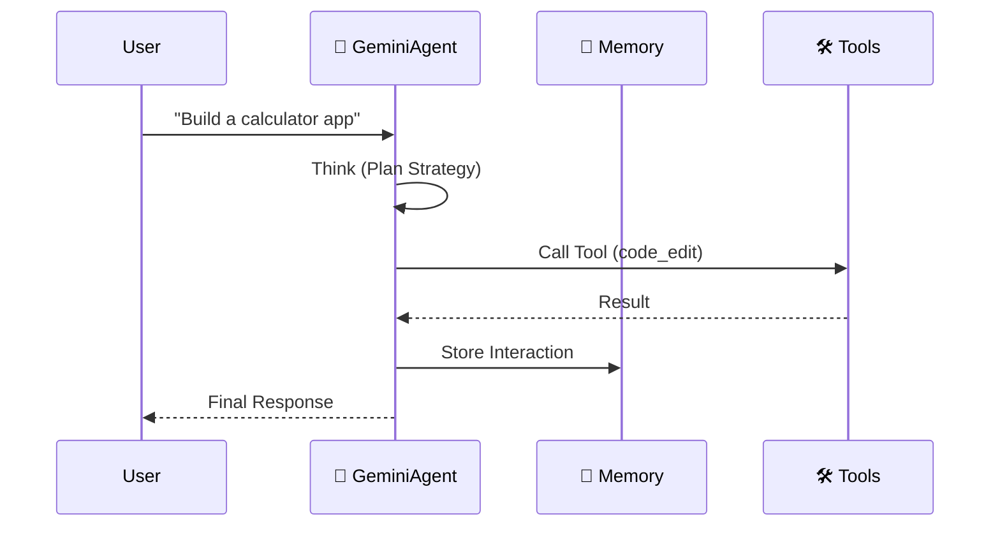

# 🪐 Google Antigravity Workspace Template (TypeScript Edition)


Welcome to the **Antigravity Workspace Template (TypeScript)**. This is a production-grade starter kit for building autonomous agents on the Google Antigravity platform, now modernized for the **Node.js** ecosystem.

## 🌟 Key Features

- **TypeScript Native**: Fully typed, modern ESM architecture.
- **Enterprise Authentication**: Supports both **Google Cloud Subscription Login** (Vertex AI) and traditional API Keys.
- **Multi-Agent Swarm**: Built-in `SwarmOrchestrator` implementing the Router-Worker pattern.
- **Infinite Memory**: JSON-based persistent memory with recursive summarization.
- **MCP Integration**: Native support for the [Model Context Protocol](https://modelcontextprotocol.io/) to connect external tools.
- **Gemini 1.5 Pro**: Pre-configured for Google's latest reliable model.

## 🚀 Quick Start

### Prerequisites
- Node.js 20+
- Google Cloud CLI (optional, for subscription login)

### 1. Installation
Clone the repo and install dependencies:
```bash
npm install
```

### 2. Authentication
You have two options:

**Option A: Subscription Login (Recommended)**
Use your enterprise credentials via Google Cloud Vertex AI.
1. Login: `gcloud auth application-default login`
2. Configure `.env`:
   ```env
   # GOOGLE_API_KEY=   <-- Leave empty
   GCP_PROJECT=your-project-id
   GCP_LOCATION=us-central1
   ```

**Option B: API Key**
Use a key from Google AI Studio.
1. Configure `.env`:
   ```env
   GOOGLE_API_KEY=your-api-key
   ```

### 3. Verify Setup
Run the auth check script to confirm your mode:
```bash
npx tsx check-auth.ts
```

### 4. Run the Agent
Start the development agent:
```bash
npm run dev
# OR run the swarm demo
npx tsx src/swarm-demo.ts
```

## 🛸 How It Works

The agent follows a strict "Think-Act-Reflect" loop:



## 📂 Project Structure

```
.
├── src/
│  ├── agent.ts          # Main GeminiAgent class
│  ├── swarm.ts          # Multi-Agent Swarm Orchestrator
│  ├── memory.ts         # Memory Manager
│  ├── config.ts         # Configuration & Auth Logic
│  ├── agents/           # Specialist Agents (Coder, Reviewer, etc.)
│  └── tools/            # Tool Definitions
├── tests/               # Vitest Suite
├── artifacts/           # Agent Outputs
├── .context/            # Knowledge Base (RAG)
├── package.json         # Dependencies
└── docker-compose.yml   # Deployment
```

## 🔥 Multi-Agent Swarm

The template includes a pre-built swarm in `src/swarm.ts`. It uses a **Router** agent to delegate tasks to specialist agents:
- **Router**: Analyzes requests and assigns work.
- **Coder**: Writes software implementations.
- **Reviewer**: Audits code for security and performance.
- **Researcher**: Gathers context.

Run the swarm demo:
```bash
npx tsx src/swarm-demo.ts
```

## 🔌 Model Context Protocol (MCP)

Connect to external data sources by configuring `mcp_servers.json`. The agent will automatically discover tools from these servers.

```bash
# Enable in .env
MCP_ENABLED=true
```

## 🧪 Testing

Run the test suite with Vitest:
```bash
npm test
```

## 🐳 Docker

Build and run the containerized agent:
```bash
docker build -t antigravity-agent .
docker run --env-file .env antigravity-agent
```